# Intelligent-Post-Lock-Down-Management-System-for-Public-Transportation
## General Description :
The proposal is to make a mobile application to manage post lock down public transportation. During this pandemic the major risk for the spread can be through the use of public transports ,the application will provide an effective solution for the passengers to board a train at railway .
Our idea is to **schedule the timing of passengers arrival** on the basis of their ticket class , for instance we can have a nominal gap in the arrival time of passengers of the 3.Ac, 2.AC and sleeper class  **resulting in the reduction in the crowd at the stations** .
 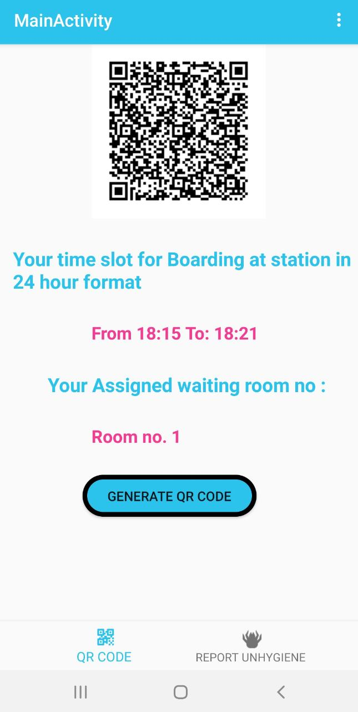 
1. User shall upload an image of a confirmed ticket for his/her travel.

2. The application will **firstly validate the uploaded  image** of ticket based on parameters such as( date of travel, ticket number, payment confirmation, Train number and name),then the user shall be asked to provide an identification proof valid by Government of India/state like aadhaar card just for the purpose of travel validation and shall be securely uploaded on database.

3. All valid ticket holders will have to pass through the check in procedures on our app which will **subsequently generate QR-CODE  on user's phones that is valid for some time after verifying the Aadhar Number** .

4. There  will be two **designated  spaces/waiting areas** where the passengers will report according to odd or even numbers based upon the last digit of your ticket number .The said QR_CODE will allow your entry into the waiting areas before boarding .
 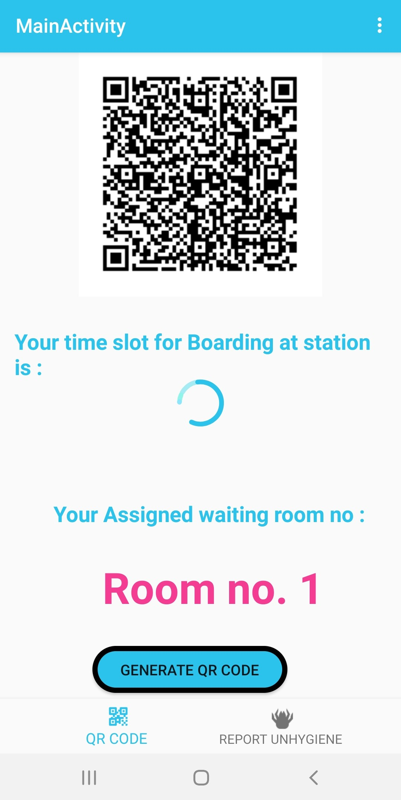 
5. Reporting pattern will be allotted at the time of check in.

## UNIQUENESS
1. Checking/scanning of tickets through **QRCode** to  avoid the direct contact of authorities at stations and will eliminate  ticket collectors (TT) or Bus Conductor resulting in less human interaction.

2. Those effluents nearby can **board at stations different from the originating station**  which will be in a radius of 10 - 15 km . This will give convenience and more hygiene to the passengers so as to achieve our goal of avoiding the crowding of stations helping the administration to manage things more efficiently .
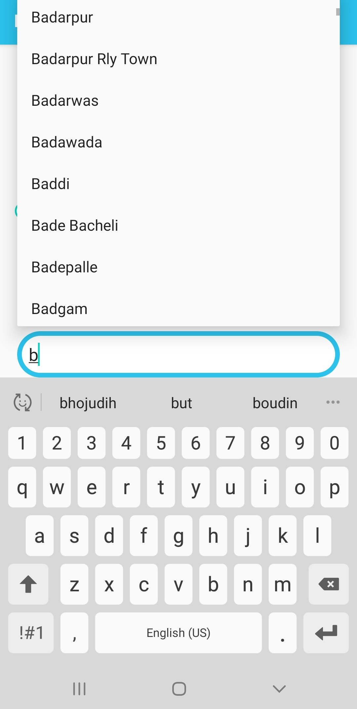 

3. There will be **prioritised entry based on a special condition like old age person, pregnant women, specially-abled** etc. And they will be allowed to move first into the train irrespective of the time slot or class. 
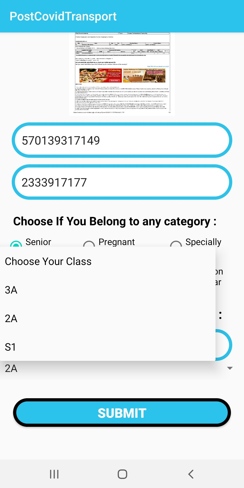

4. App will **maintain a record of travels made by a particular passenger** and notify if a passenger travels more than 5 times a month. Then the passenger shall need to provide a particular reason for travel and get a monthly pass for travelling.
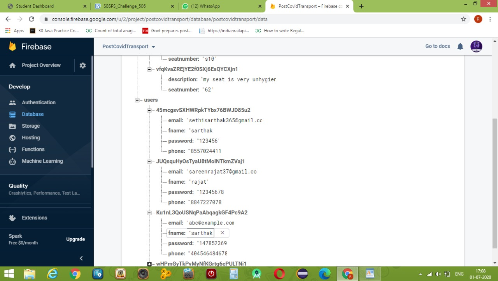   

5. **Slots** will allow the crowd to divide and maintain social distance at the time of boarding the train.

6. We will provide additional facilities to the passengers availing QR_CODE systems to **report any cleannlines** if required by press of a click supporting swachh bharat (ek kadam swachhata ki aur).

## Business / Social Impact:
1. No checking of tickets inside the train as they have already been checked before. This will **avoid ticket collector** (TT) /Bus Conductor saving the man cost for ticket verification .

2. Discipline as people will report in their particular time slots to board the train. 

## Technology Stack:
- Software Used : Android Studio (3.6.3),Adobe Illustrator, Corel DRAW
- Languages: Java(J2ME),XML(UI/UX Development)
- Database : Google Firebase, Cloud Server,sql-lite(for Devise Storage)
- Frameworks and API : Machine Learning KIT, Adhar API ,QR-ENCODER
- API Level 19 : Runs on 98.1% percent of devices (Android 4.4 (Kitkat)) [min android version]

## Scope of Work:
1. When the user opens the application, a **splash screen** will appear with a logo and a social message in it which will run for 3 secs.
                    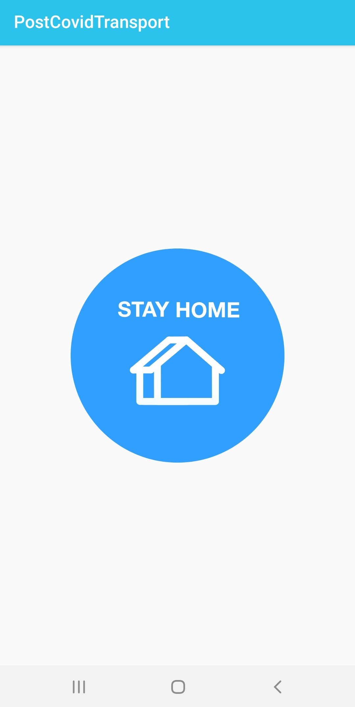

2.  Then a **login screen** will open where the user has to input username and password in edit-texts, which will be validated. If not registered,the user will be directed to sign up activity where the user has to provide his personal details.
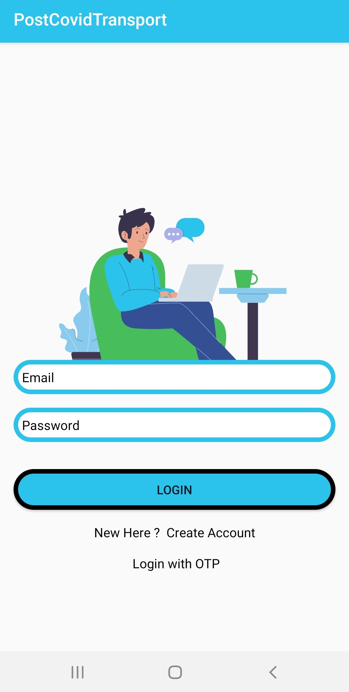         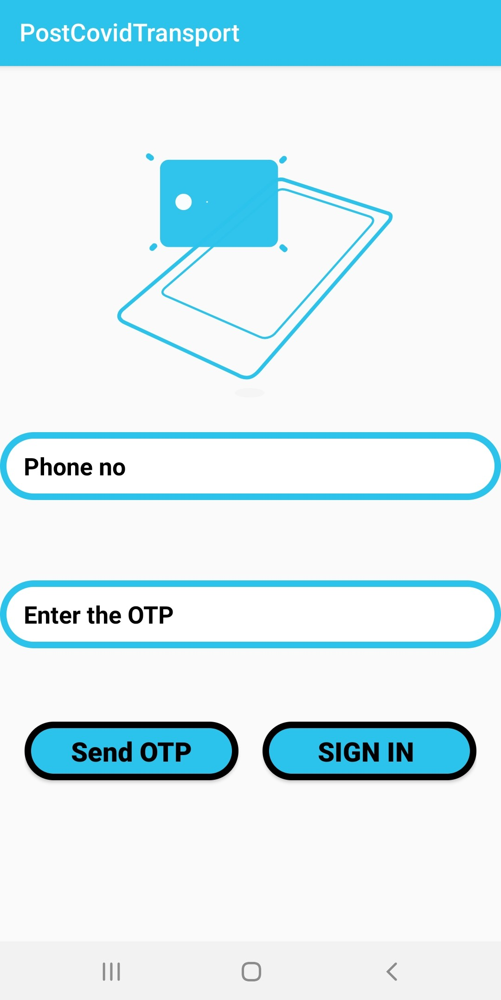      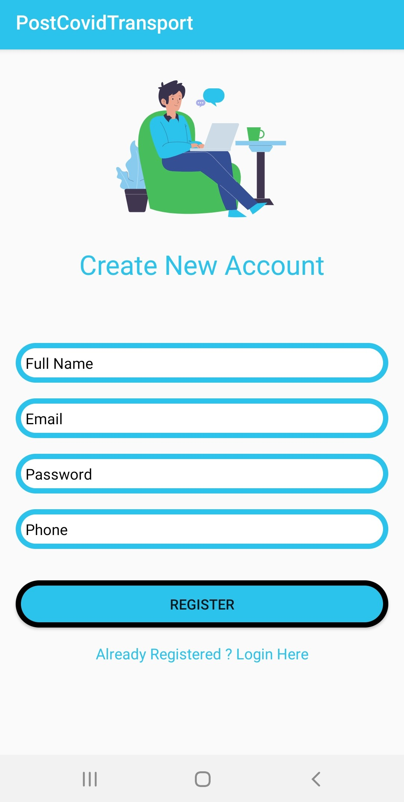

3. On successful validation, users shall be directed to the **main activity** which will have a Bottom navigation view and a menu bar to select categories like(help, support, guidelines, report a problem) etc. In this activity. there shall be 3 edit-texts 1st for ticket number, second for train no. /PNR  no, third for aadhar no of users. Then the details will be validated on the click of submit button. 
 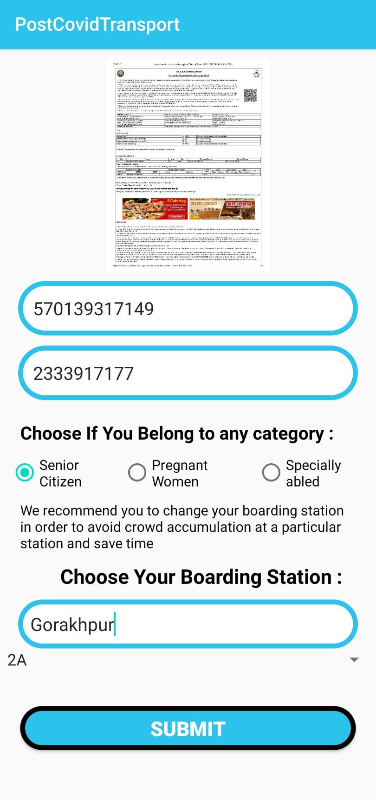   
After that the user can select the check-in station from the cities given in the spinner which will vary according to the train's route. 

4. then a new activity will open which will display a **QR Code with ticket details** in it. Also the time slot for check-in will be displayed in the textview and the check-in station in another textview. 
  

Users shall have to show this qr at the time of check-in to travel which will be generated 2 hours prior to the departure of the train/bus.

5. If a user clicks on the **report cleanliness** button from bottom navigation view in main activity, user will be directed to an activity where there will be certain cues that user will have to answer and the answers will be submitted to concerned authority. 
Similarly on the click of guidelines button, the user will be taken to another activity where the user will be **shown particular guidelines** to keep oneself safe during and after travel.
 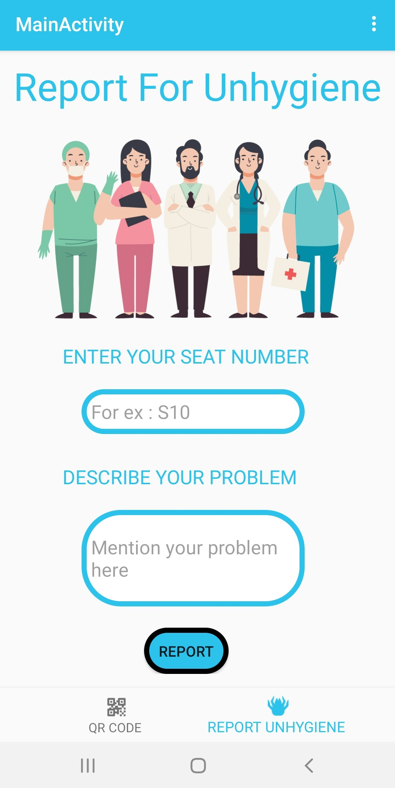 

6. Using the **logout button** in the main activity, the user will be logged out of the application.
 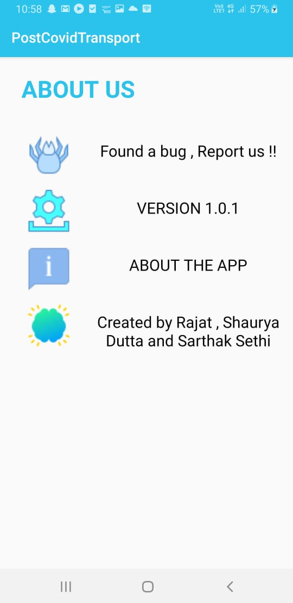  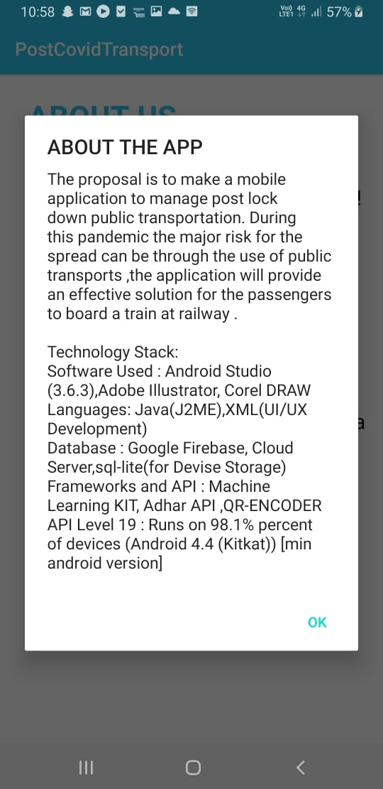

## YOUTUBE LINK
[Complete explanation video link](https://www.youtube.com/watch?v=xR7iHWfM8lw&feature=youtu.be)
